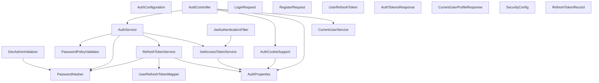

# auth 模块 · 类级调用总览

> 本图展示模块内 Class→Class 依赖总览（Controller→Service→Mapper/Engine），不带方法名；想看方法名请打开同目录下对应的方法级图。由 `docs/callgraph/modflow.py` 生成。

```mermaid
flowchart TD
  n58["CurrentUserService"]
  n59["AuthConfiguration"]
  n60["AuthProperties"]
  n61["DevAdminInitializer"]
  n62["AuthController"]
  n63["UserRefreshTokenMapper"]
  n64["LoginRequest"]
  n65["RegisterRequest"]
  n66["UserRefreshToken"]
  n67["AuthTokensResponse"]
  n68["CurrentUserProfileResponse"]
  n69["AuthCookieSupport"]
  n70["JwtAccessTokenService"]
  n71["JwtAuthenticationFilter"]
  n72["RefreshTokenService"]
  n73["SecurityConfig"]
  n74["AuthService"]
  n75["PasswordHasher"]
  n76["PasswordPolicyValidator"]
  n77["RefreshTokenRecord"]

  n61 --> n75
  n62 --> n58
  n62 --> n60
  n62 --> n69
  n62 --> n74
  n69 --> n60
  n70 --> n60
  n71 --> n70
  n72 --> n60
  n72 --> n63
  n72 --> n75
  n74 --> n70
  n74 --> n72
  n74 --> n75
  n74 --> n76
```
