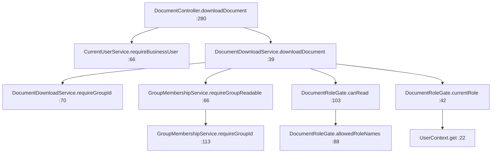

# document · DocumentController.downloadDocument 调用链

> 由 `docs/callgraph/gen_all.py` 静态分析自动生成（纯说明，不改任何代码）。
> 每个节点 = 一个被调用的方法（`方法名:文件内行号`）；箭头 = 调用方向；getter/简单投影已省略。

```mermaid
flowchart TD
  m1["DocumentController.downloadDocument :280"]
  m2["CurrentUserService.requireBusinessUser :66"]
  m3["DocumentDownloadService.downloadDocument :39"]
  m4["DocumentDownloadService.requireGroupId :70"]
  m5["GroupMembershipService.requireGroupReadable :66"]
  m6["DocumentRoleGate.canRead :103"]
  m7["DocumentRoleGate.currentRole :42"]
  m8["GroupMembershipService.requireGroupId :113"]
  m9["DocumentRoleGate.allowedRoleNames :88"]
  m10["UserContext.get :22"]

  m1 --> m2
  m1 --> m3
  m3 --> m4
  m3 --> m5
  m3 --> m6
  m3 --> m7
  m5 --> m8
  m6 --> m9
  m7 --> m10
```
