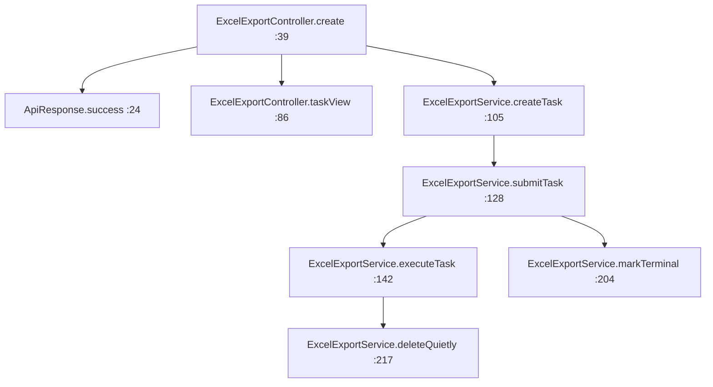

# excel · ExcelExportController.create 调用链

> 由 `docs/callgraph/gen_all.py` 静态分析自动生成（纯注释说明，不改任何代码）。
> 每个节点 = 一个被调用的方法（`方法名:文件内行号`）；箭头 = 调用方向；getter/简单投影已省略以减噪。

```mermaid
flowchart TD
  m1["ExcelExportController.create :39"]
  m2["ApiResponse.success :24"]
  m3["ExcelExportController.taskView :86"]
  m4["ExcelExportService.createTask :105"]
  m5["ExcelExportService.submitTask :128"]
  m6["ExcelExportService.executeTask :142"]
  m7["ExcelExportService.markTerminal :204"]
  m8["ExcelExportService.deleteQuietly :217"]

  m1 --> m2
  m1 --> m3
  m1 --> m4
  m4 --> m5
  m5 --> m6
  m5 --> m7
  m6 --> m8
```
